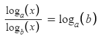

Big-O notation classifies algorithms by how much the runtime and memory requirements correlate with the input size.
For big-O notation, only the most complex component matters, and coefficients are discarded.

Ordering for big-O complexity (k is any constant):
 1. *O(1)* least complex
 2. *O(logn)*
 3. *O(n)*
 4. *O(nk)* more complex with greater k (k>1)
 5. *O(kn)* more complex with greater k (k>1)
 6. *O(n!)*
 7. *O(nn)* most complex

 ---

 ### 1
 *f(n) = 10n8 + log3(n2 + n) + √(2n-2)*

 *O(f(n)) = O(√2n)*
 
*√(2n-2)* simplifies to *(√2)n* by rearranging and removing constants. 
Exponential is more complex than polynomial, so term 1 can be ignored.
*logn2* is less complex because *logn* is less complex than the constant,
 and *n2* is less complex than the exponential, so term 2 can be ignored.

 ### 2
 *logn* is less complex than *n* so if they are added only *n* remains.

 ### 3
 All logarithms of different bases are related by constant factors, so the base doesn't matter.

 

### 4
See *bottles_of_beer.py*

### 5
For a given input n, the song calls for two printed lines from 0-n, which is 2n+2 lines.